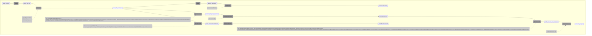

# Tests

```mermaid
flowchart LR
    classDef action fill:#999,color:#000;
    GetState1:::action
    GetState2:::action
    CreateNew(CreateNew):::action
    UnlockStorage(UnlockStorage):::action
    QrCodeScanned1(QrCodeScanned):::action
    QrCodeScanned2(QrCodeScanned):::action
    QrCodeScanned3(QrCodeScanned):::action
    CredentialOffersSelected(CredentialOffersSelected):::action
    ConnectionAccepted(ConnectionAccepted):::action
    CredentialsSelected(CredentialsSelected):::action

    classDef payload fill:#CCC,color:#555,text-align:left;
    P1("`name: 'Ferris Crabman'
        picture: '&#129408'
        theme: 'system'
        password: 'sup3rSecr3t'
    `"):::payload
    P2("`password: 'sup3rSecr3t'`"):::payload
    P3("`form_urlencoded: 'openid-credential-offer://?credential_offer=%7B%22credential_issuer%22%3A%22http%3A%2F%2F0.0.0.0%3A8000%2F%22%2C%22credentials%22%3A%5B%7B%22format%22%3A%22jwt_vc_json%22%2C%22credential_definition%22%3A%7B%22type%22%3A%5B%22VerifiableCredential%22%2C%22PersonalInformation%22%5D%7D%7D%5D%2C%22grants%22%3A%7B%22urn%3Aietf%3Aparams%3Aoauth%3Agrant-type%3Apre-authorized_code%22%3A%7B%22pre-authorized_code%22%3A%220YI5DXtuCltKyNa5%22%2C%22user_pin_required%22%3Afalse%7D%7D%7D'`"):::payload
    P4("`offer_indices: '[0]'`"):::payload
    P5("`form_urlencoded: 'siopv2://idtoken?response_type=id_token&client_id=did%3Akey%3Az6Mkm9yeuZK7inXBNjnNH3vAs9uUjqfy3mfNoKBKsKBrv8Tb&scope=openid&redirect_uri=https%3A%2F%2Fexample.com&nonce=nonce'`"):::payload
    P6("`form_urlencoded: 'siopv2://idtoken?response_type=vp_token&client_id=did%3Akey%3Az6Mkm9yeuZK7inXBNjnNH3vAs9uUjqfy3mfNoKBKsKBrv8Tb&presentation_definition=%7B%22id%22%3A%22Verifiable+Presentation+request+for+sign-on%22%2C%22input_descriptors%22%3A%5B%7B%22id%22%3A%22Request+for+Ferris%27s+Verifiable+Credential%22%2C%22constraints%22%3A%7B%22fields%22%3A%5B%7B%22path%22%3A%5B%22%24.vc.type%22%5D%2C%22filter%22%3A%7B%22type%22%3A%22array%22%2C%22contains%22%3A%7B%22const%22%3A%22PersonalInformation%22%7D%7D%7D%2C%7B%22path%22%3A%5B%22%24.vc.credentialSubject.givenName%22%5D%7D%2C%7B%22path%22%3A%5B%22%24.vc.credentialSubject.familyName%22%5D%7D%2C%7B%22path%22%3A%5B%22%24.vc.credentialSubject.email%22%5D%7D%2C%7B%22path%22%3A%5B%22%24.vc.credentialSubject.birthdate%22%5D%7D%5D%7D%7D%5D%7D&redirect_uri=https%3A%2F%2Fexample.com&nonce=nonce'`"):::payload
    P7("`credentials selected: '[0]'`"):::payload


    subgraph o
    direction LR
        Initial[[default_state.json]] --- GetState1(GetState) --> B[[check_state.json]]
        B --- CreateNew --> C[[new_profile_created.json]]
        P1 -.-> CreateNew
        C --- GetState2(GetState) --> D[[password_required.json]]
        D --- UnlockStorage --> E[[storage_unlocked.json]]
        P2 -.-> UnlockStorage
        C --- QrCodeScanned1 --> F[[credential_offer_user_prompt.json]]
        P3 -.-> QrCodeScanned1
        F --- CredentialOffersSelected --> G[[new_credentials.json]]
        P4 -.-> CredentialOffersSelected
        C --- QrCodeScanned2 --> H[[siopv2_request_user_prompt.json]]
        P5 -.-> QrCodeScanned2
        H --- ConnectionAccepted --> I[[accepted_connection.json]]
        G --- QrCodeScanned3 --> J[[oid4vp_response_user_prompt.json]]
        P6 -.-> QrCodeScanned3
        J --- CredentialsSelected --> K[[credentials_sent.json]]
        P7 -.-> CredentialsSelected
    end

```

